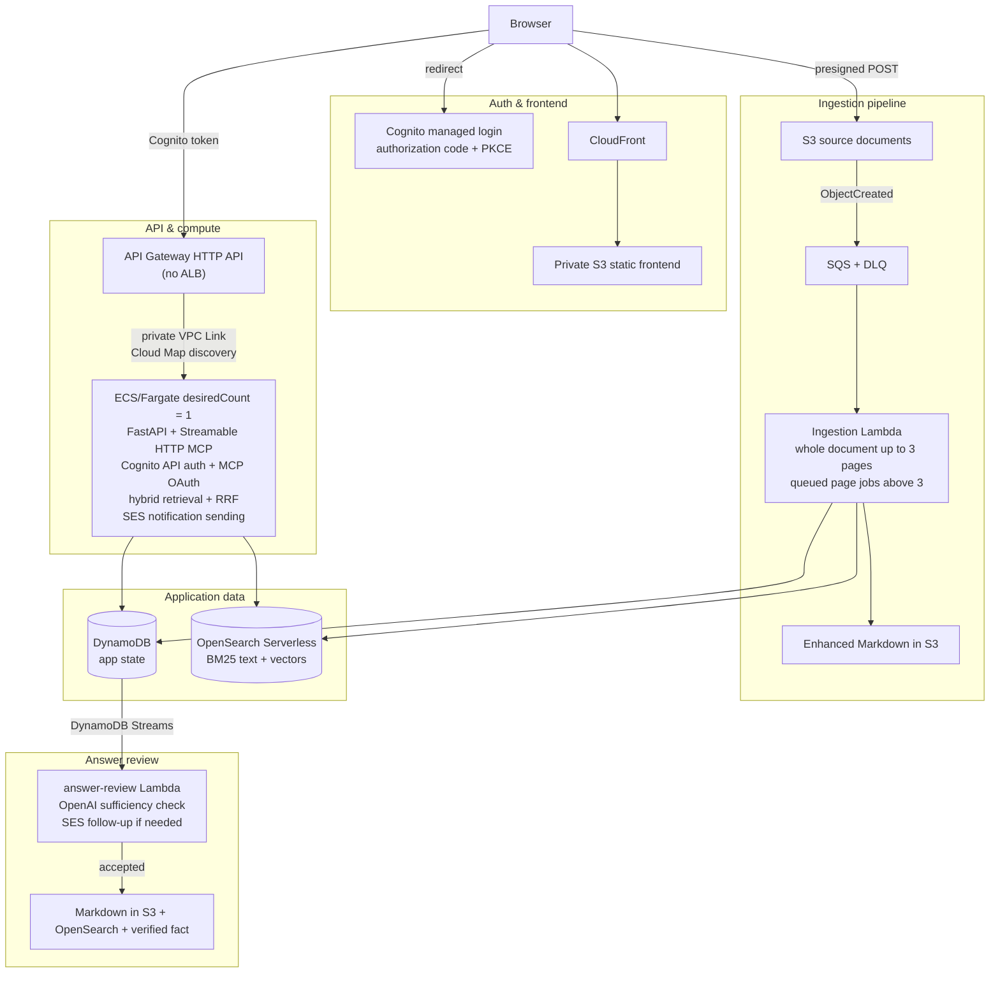
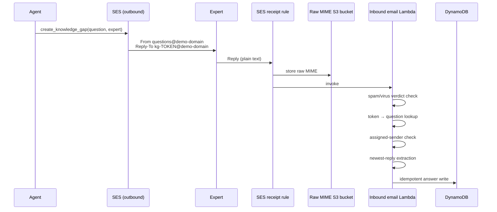
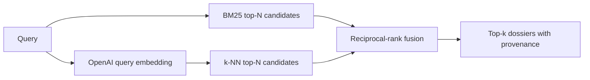

# Relay


A deliberately compact AWS-native project knowledge system. Claude, Codex, or
another MCP client is the primary knowledge-work interface; the custom website
is limited to the workflows that genuinely benefit from a visual surface:

1. document upload and ingestion status, authenticated outside public-demo mode;
2. cross-project hybrid search with direct project navigation and downloads;
3. an expert-answer queue as a fallback when answering by email is inconvenient.

The ordinary expert workflow is simpler: receive a question, press **Reply**,
write the missing information, and finish. Each email also includes a private
one-question browser link that does not require a general application login.
The server validates the response, checks whether it actually resolves the
question, and turns accepted knowledge into a small source document that is
immediately retrievable by the agent.

## What is included

- Declarative Python CDK infrastructure, synthesized to CloudFormation.
- One ECS/Fargate task running FastAPI and a remote Streamable HTTP MCP server.
- API Gateway HTTP API with a private Cloud Map integration; no load balancer.
- A private S3 static website behind CloudFront, with the same CloudFront
  domain proxying the public MCP and OAuth routes.
- Cognito managed login with authorization-code flow and PKCE.
- MCP OAuth discovery, dynamic client registration, short-lived access tokens,
  rotating refresh tokens, and Cognito-backed browser sign-in.
- Presigned browser-to-S3 uploads.
- S3 notification to SQS and a container-image ingestion Lambda.
- PDF, legacy DOC, DOCX, PPTX, TXT, Markdown, CSV, and JSON text extraction.
- High-detail print rendering plus deterministic text sent together to
  `gpt-5.4-mini` for PDF, DOC, DOCX, and PPTX normalization into clean Markdown.
- Enhanced Markdown retained in S3, including vision recovery for scanned PDFs
  and image-only slides. Documents over three rendered pages are normalized and
  embedded page-by-page, then concatenated in page order into one `document.md`.
- OpenAI `text-embedding-3-large` embeddings with configurable dimensions.
- One OpenSearch Serverless NextGen vector-search collection containing both
  searchable text and vectors.
- Independent BM25 and vector searches combined with reciprocal-rank fusion.
- A global web search that uses the same hybrid retrieval backend, collapses
  page-level matches into documents, and links each result back to its project.
- DynamoDB for projects, documents, facts, gaps, reply routes, answers, review
  state, and expert assignments.
- SES domain identity, Easy DKIM, custom MAIL FROM records, inbound MX, DMARC,
  outbound expert notifications, and inbound reply handling.
- Raw inbound MIME messages retained temporarily in a private S3 bucket.
- An inbound Lambda that validates the recipient token and expected sender,
  extracts the newest reply, and writes an idempotent answer to DynamoDB.
- A DynamoDB Streams review Lambda that checks answer sufficiency with a
  server-side OpenAI structured-output call.
- Automatic email follow-up when the answer is useful but incomplete.
- Accepted answers become one Markdown document in S3, one searchable
  OpenSearch document, and a verified fact in DynamoDB.
- Safe helper scripts for Route 53 domain registration, SES recipient
  verification, and email readiness checks.

This remains an MVP rather than a generic enterprise platform. Its boundaries
are explicit so project ACLs, richer evaluation, and notifications to other
channels can be added without rewriting the core retrieval or
knowledge-capture flow.

## Architecture

CloudFront serves the SPA and is also the canonical public origin for `/mcp/`,
OAuth discovery, registration, token exchange, and the Cognito callback.



The knowledge-gap email loop is a sequence of actors and messages rather than a
static deployment shape:



Original and generated documents in S3 plus application records in DynamoDB are
authoritative. OpenSearch is rebuildable derived state. Raw inbound mail is kept
for 30 days by default for audit and parser debugging.

## Retrieval contract

Each small project dossier is indexed once with its complete text, one vector,
project/document metadata, S3 provenance, and a deterministic index identifier.
The query service runs two independent channels:



For a document at lexical rank `r_l` and vector rank `r_v`, the default fusion
score is:

```text
RRF(document) = 1 / (60 + r_l) + 1 / (60 + r_v)
```

A channel contributes only when the document appears in that channel. Raw
engine scores are preserved in the response, but neither BM25 nor vector
similarity is treated as a calibrated probability.

## Knowledge-gap and email loop

1. The agent searches the project and determines that evidence is absent or
   insufficient.
2. It calls `create_knowledge_gap` with the question, the assigned expert, and
   useful retrieval/task context.
3. DynamoDB stores the question plus a cryptographically random lowercase reply
   token. Only a SHA-256 digest of that token is used as the reverse-lookup key.
4. SES sends the question to the expert. Failure to send does **not** delete the
   gap; notification state and the SES error are recorded for retry.
5. The expert can reply to the email or use its private one-screen answer link.
   The link carries the high-entropy reply token in the URL fragment, which is
   not included in the initial HTTP request; the SPA sends it to the API in an
   `X-Answer-Token` header. Both paths use the same downstream workflow.
6. SES stores the complete MIME message in S3, then invokes the inbound Lambda.
7. The Lambda rejects failed spam/virus verdicts, resolves the gap from the
   envelope recipient, checks the sender against the assigned expert, extracts
   the newest text reply, and writes an answer keyed deterministically by the SES
   message ID. Re-delivery is therefore idempotent.
8. DynamoDB Streams invokes the review Lambda.
9. A sufficient answer is normalized into a Markdown note, stored in S3,
   embedded and indexed in OpenSearch, saved as a verified fact, and marked
   resolved.
10. An insufficient answer is marked `NEEDS_MORE_INFO`, and SES sends a focused
    follow-up to the same expert using the same reply address. The next review
    receives the cumulative answer history, so the expert only needs to provide
    the missing detail rather than repeat the full response.

The reply address is intentionally independent of the subject and thread
headers. People can rename subjects, and mail clients routinely transform
threads; the envelope recipient remains the most dependable routing signal.

## Repository layout

```text
.
├── app.py
├── infrastructure/
│   └── knowledge_stack.py          # all AWS resources
├── frontend/                       # upload + expert-answer fallback SPA
├── services/
│   ├── api/                        # FastAPI + MCP + outbound SES
│   ├── ingestion_lambda/           # document ingestion image
│   ├── inbound_email_lambda/       # MIME reply processing image
│   └── review_lambda/              # answer review + follow-up image
├── plugins/
│   └── blend-project-knowledge/    # Codex/Claude MCP + dossier-writing skill
├── src/knowledge_core/
│   ├── email_parsing.py
│   ├── email_service.py
│   ├── question_workflow.py
│   └── ...
├── scripts/
│   ├── register_domain.py
│   ├── verify_ses_recipients.py
│   ├── email_setup_status.py
│   └── ...
└── tests/
```

## Prerequisites

- An AWS sandbox account and credentials with permission to deploy the resources
  in the stack.
- Docker available to the CDK asset builder.
- Python 3.12 or 3.13 and `uv`.
- Node.js with `npx` for the AWS CDK CLI.
- AWS CLI v2 for post-deployment helpers.
- An OpenAI API key with access to the configured embedding and review models.
- For reply-by-email: a domain whose public hosted zone is in Route 53.

The default region is `us-east-1`. SES identities, sandbox status, sending
limits, and receipt rules are regional. Keep the email resources and application
in the same region for this prototype.

## Register a disposable prototype domain

Domain registration is intentionally **not** hidden inside CloudFormation. It is
a billable registrar operation containing private contact data, and a typo is
not normally refundable. The helper is dry-run by default and requires the exact
domain a second time before it can submit a purchase.

First copy the ignored contact template:

```bash
cp scripts/domain-contact.example.json scripts/domain-contact.json
# Fill scripts/domain-contact.json with real registrant information.
```

Check availability and Route 53 pricing without buying anything:

```bash
python scripts/register_domain.py your-demo-domain.com
```

Submit the registration only after checking the printed domain and price:

```bash
python scripts/register_domain.py your-demo-domain.com \
  --contact-file scripts/domain-contact.json \
  --confirm-purchase your-demo-domain.com \
  --wait
```

The helper defaults to one year, contact privacy enabled, and automatic renewal
disabled. Route 53 Domains runs in `us-east-1`, creates a public hosted zone after
successful registration, assigns its name servers to the domain, and may send a
registrant verification message that must be handled promptly.

A manually registered Route 53 domain works equally well; skip this script when
the hosted zone already exists.

## Deploy with SES reply handling

After domain registration succeeds and the hosted zone exists:

```bash
EMAIL_DOMAIN='your-demo-domain.com' \
EMAIL_SENDER_LOCAL_PART='questions' \
./scripts/deploy.sh
```

With `EMAIL_DOMAIN` present, CDK adds:

- a domain-level SES identity;
- Easy DKIM records;
- a custom `mail.<domain>` MAIL FROM domain and its DNS records;
- `questions@<domain>` as the default sender;
- the root-domain inbound SES MX record;
- a permissive prototype DMARC record (`p=none`);
- a private 30-day inbound MIME bucket;
- the inbound email Lambda;
- an SES receipt rule that first stores the message in S3 and then invokes the
  Lambda;
- the custom resource that makes this receipt rule set active;
- least-purpose send permissions for Fargate and the review Lambda.

Email remains optional. Running `./scripts/deploy.sh` without `EMAIL_DOMAIN`
deploys the original web-queue-only behavior.

### Important: one active receipt rule set

Classic SES receiving permits one active receipt rule set in an account/region.
This prototype activates its own set and therefore assumes ownership of inbound
SES receiving in that region. Destroying the stack deactivates SES receiving.
Use a clean sandbox region or merge these rules into an existing set before
sharing the account with another inbound-email system.

## Configure the application

Store the OpenAI key after the stack exists:

```bash
OPENAI_API_KEY='sk-...' ./scripts/configure_openai.sh
```

Create the first Cognito user:

```bash
PASSWORD='A-Long-Temporary-Password1' \
uv run python scripts/create_user.py agustin@example.com \
  --admin \
  --profile '<aws-profile>'
```

The boto3 user helper is idempotent. It suppresses Cognito email by default,
marks the address as verified, and configures the supplied password as
permanent. Omit `PASSWORD` to enter it without exposing it in shell history.
Use `--send-invitation` only when Cognito should send a temporary password.

Open the `FrontendUrl` output:

```bash
python scripts/stack_output.py FrontendUrl
```

### Bootstrap documents from a local directory

The local ingestion helper is an administrative bootstrap path. It creates or
reuses a project directly in DynamoDB and uploads originals to the deployment's
private document bucket. Those uploads use the same key and metadata contract
as the web API, so the normal S3 notification, SQS queue, ingestion Lambda,
enhanced Markdown generation, embedding, and OpenSearch indexing all run.

Preview a reproducible 50-document sample without changing AWS:

```bash
uv run python scripts/ingest_local_documents.py "PIH - Dataset" \
  --count 50 \
  --seed 20260725 \
  --project-name "PIH trial" \
  --profile '<aws-profile>' \
  --dry-run
```

Submit the same sample:

```bash
uv run python scripts/ingest_local_documents.py "PIH - Dataset" \
  --count 50 \
  --seed 20260725 \
  --project-name "PIH trial" \
  --uploaded-by agustin@example.com \
  --profile '<aws-profile>'
```

The command writes `initial-ingestion-report.json`. Document IDs are
deterministic for a project and file content, so rerunning the command skips
documents it has already provisioned. Add `--retry-failed` to resubmit records
whose ingestion or upload failed.

Monitor only the documents recorded by that run:

```bash
uv run python scripts/ingestion_status.py \
  --report initial-ingestion-report.json \
  --profile '<aws-profile>' \
  --wait
```

The public-demo and administrative bootstrap upload limit is 25 MiB per file.
When authentication is enabled, signed-in browser users can upload up to
100 MiB. The current oversized PIH bootstrap files remain intentionally
deferred even though page-level processing is available. Supported extensions
are PDF, DOC, DOCX, PPTX, TXT, Markdown, CSV, and JSON. The ingestion Lambda has
two reserved concurrent executions, so document and page jobs intentionally
drain through the queue instead of launching every model call at once.

### Future Blend Microsoft SSO

Cognito remains the token issuer for the frontend, API, and MCP clients. The
stack can federate its managed login only to the Blend Microsoft Entra tenant.
When enabled, Microsoft is the only client-facing identity provider; no local
password fallback is exposed.

Create a Microsoft Entra app registration using the Cognito domain from
`python scripts/stack_output.py CognitoDomain` and its `/oauth2/idpresponse`
redirect URI. Once a tenant ID, application client ID, and client secret are
available, store them and enable Microsoft:

```bash
uv run python scripts/configure_sso.py microsoft \
  --tenant-id '<entra-tenant-id>' \
  --client-id '<entra-application-client-id>' \
  --profile '<aws-profile>'

AWS_PROFILE='<aws-profile>' MICROSOFT_SSO=1 ./scripts/deploy.sh
```

Keep `MICROSOFT_SSO=1` in `.env` for subsequent authenticated deployments.

### Verify demo recipients in the SES sandbox

New SES accounts normally begin in the sandbox. The sender domain is verified by
CDK/DNS, but each recipient used by the demo must also approve an SES identity
verification message:

```bash
python scripts/verify_ses_recipients.py \
  expert.one@example.com \
  expert.two@example.com \
  --wait
```

The production-access request is unnecessary for a small demo with a known list
of verified experts.

### Check email readiness

```bash
python scripts/email_setup_status.py
```

The command reports the SES account mode, domain verification, DKIM, MAIL FROM,
active receipt rule set, hosted zone, inbound MX, and DMARC record. DNS and SES
identity verification can take some time immediately after deployment.

## Exercise the end-to-end email path

1. Sign in to the frontend, create a project, and upload at least one source.
2. Connect Claude or Codex to the MCP.
3. Ask something the corpus cannot answer.
4. Let the agent call `create_knowledge_gap` with a verified expert address.
5. Confirm the expert receives an email from `questions@<domain>`.
6. Reply in plain text or select **Answer in your browser** and submit the
   one-question form.
7. Observe the assigned question move through review and either resolve or
   trigger a focused follow-up email.
8. Search again through MCP; an accepted answer is now returned as an
   `EXPERT_QA` source with provenance.

The private browser link works independently of the general application login,
including after Microsoft SSO is enabled. It reveals only the project name,
question, relevant context, priority, and review feedback—not internal IDs,
reply addresses, or the assigned expert's email.

## Connect an MCP client

Print the CloudFront Streamable HTTP endpoint and client setup commands:

```bash
./scripts/show_mcp_connection.sh
```

The `McpConnectUrl` stack output is a shareable CloudFront page that displays
the deployed MCP URL and a copy button.

The deployment exposes standards-based OAuth discovery. ChatGPT, Codex, Claude,
and other compatible remote MCP clients can register dynamically, open the
Cognito login page, and retain short-lived credentials without the user copying
a token.

For a short-lived public demo only, set `MCP_AUTH_ENABLED=0` in `.env` and
deploy. This bypasses MCP authentication while leaving the future Microsoft
Entra configuration intact. The main page opens directly to the shared
workspace, including its upload area, and both the HTTP API and all MCP tools
are public in this mode. Remove the override or set it back to `1` and deploy
to require Microsoft-backed browser and MCP sign-in once the Entra credentials
are configured.

To serve both the page and MCP from a Route 53 domain, set `PUBLIC_DOMAIN` to
the same root domain used by `EMAIL_DOMAIN`. CDK provisions a DNS-validated ACM
certificate, attaches the hostname to CloudFront, and creates apex `A` and
`AAAA` aliases. The resulting MCP endpoint is
`https://<PUBLIC_DOMAIN>/mcp/`.

For Codex:

```bash
codex mcp add blend-knowledge --url '<McpUrl stack output>'
codex mcp login blend-knowledge
```

For Claude Code:

```bash
claude mcp add --transport http --scope user \
  blend-knowledge '<McpUrl stack output>'
```

Then run `/mcp` and complete the Cognito browser login. In ChatGPT or Claude,
add the same `McpUrl` as a custom plugin or connector and select **Connect**.

### Install the agent plugin

The repository contains `blend-project-knowledge`, a cross-client plugin that
packages the remote MCP together with the `create-project-dossier` skill. The
skill adds the evidence-first research sequence, required dossier structure,
inline citation rules, and relevant-visual guidance that an MCP connection by
itself cannot reliably trigger.

Build the downloadable archive:

```bash
python3 scripts/build_plugin_bundle.py
```

This creates
`frontend/downloads/blend-project-knowledge-bundle.zip`, which the web
interface offers from **Get the agent plugin**. Extract it, then install it in
either client.

For Codex:

```bash
codex plugin marketplace add ~/Downloads/blend-project-knowledge-bundle
codex plugin add blend-project-knowledge@blend360-project-knowledge
```

Start a new Codex thread and invoke `$create-project-dossier`, or ask for a
project dossier, sales brief, success story, case study, capability story, or
client story.

For Claude Code:

```bash
claude plugin marketplace add ~/Downloads/blend-project-knowledge-bundle
claude plugin install blend-project-knowledge@blend360-project-knowledge
```

Run `/reload-plugins`, then invoke
`/blend-project-knowledge:create-project-dossier` or ask for the same artifact
in natural language.

### MCP tools

- `list_projects`
- `search_knowledge`
- `list_project_documents`
- `get_document_text`
- `get_document_download_url`
- `list_verified_facts`
- `create_knowledge_gap`
- `resend_knowledge_gap_email`
- `get_knowledge_gap`
- `record_verified_fact`

`search_knowledge` returns ranked dossier previews, document provenance, BM25
and vector ranks, raw channel scores, RRF score, and warnings when one retrieval
channel failed. It accepts `top_k` values from 1 through 25; use 5 for focused
lookup or 10–20 for broader research. Use `get_document_text` to load the
complete text of the best matching dossiers.

`get_document_download_url` returns a 15-minute download URL for either the
uploaded original or the consolidated cleaned Markdown. The web document list
offers the same two download choices.

The MCP server also gives clients an explicit evidence-first workflow:
`list_projects` when the project ID is unknown, several focused
`search_knowledge` calls, `get_document_text` for the strongest sources, and
source-cited answers grounded only in retrieved text or verified facts. It
directs the agent to create a knowledge gap only after retrieval is exhausted
and requires explicit confirmation before any tool sends email or records an
authoritative fact.

The email and verified-fact tools are marked with MCP safety annotations.
Email tools require explicit user confirmation. `create_knowledge_gap` and
`record_verified_fact` also require a stable `request_id`; retry the same
intended write with the same value to avoid duplicate records or notifications.

## HTTP API surface

The web UI uses Cognito ID tokens when authentication is enabled. In public-demo
mode, the same endpoints use a fixed guest principal and require no bearer
token. The relevant endpoints are:

```text
GET    /healthz
GET    /api/public/question
POST   /api/public/question/answers
GET    /api/me
GET    /api/projects
POST   /api/projects
POST   /api/search
POST   /api/projects/{project_id}/uploads/presign
GET    /api/projects/{project_id}/documents
GET    /api/projects/{project_id}/documents/{document_id}/text
GET    /api/projects/{project_id}/documents/{document_id}/download-url
POST   /api/projects/{project_id}/search
GET    /api/projects/{project_id}/facts
POST   /api/projects/{project_id}/facts
GET    /api/projects/{project_id}/questions
POST   /api/projects/{project_id}/questions
GET    /api/projects/{project_id}/questions/{question_id}
POST   /api/projects/{project_id}/questions/{question_id}/notification
GET    /api/questions/assigned
POST   /api/projects/{project_id}/questions/{question_id}/answers
POST   /mcp/
```

FastAPI's generated OpenAPI document is available at `/docs` after deployment.
The two `/api/public/question` operations use the private answer token instead
of a Cognito identity. Every other `/api` operation requires a valid Cognito
token when authentication is enabled; public-demo mode deliberately permits
unauthenticated access.

## Development checks

```bash
uv sync --all-groups
uv run pytest
uv run ruff check .
uv run python app.py
node --check frontend/app.js
```

Build the runtime images directly with:

```bash
docker build -f services/api/Dockerfile .
docker build -f services/ingestion_lambda/Dockerfile .
docker build -f services/inbound_email_lambda/Dockerfile .
docker build -f services/review_lambda/Dockerfile .
```

## Deliberate MVP constraints

- **Shared workspace:** every Cognito user can currently see every project.
  Project membership and per-project authorization are the first real deployment
  hardening step.
- **Authentication without project ACLs:** remote MCP users authenticate
  individually through Cognito, but all authenticated users still share the
  same project visibility.
- **Exact sender match:** an inbound reply must come from the assigned expert's
  address. Aliases, forwarding, and delegated mailboxes can require a richer
  identity policy later.
- **Heuristic reply extraction:** MIME parsing prefers `text/plain`, falls back to
  sanitized HTML text, and removes common quoted-thread formats. Pathological
  email-client formatting may need parser-specific rules.
- **No reply attachments:** attached evidence is preserved in raw MIME but is not
  added to the project corpus automatically.
- **Domain-wide receipt rule:** dynamic reply addresses require receiving the
  domain. Unknown recipients are stored briefly and ignored by the Lambda. A
  production system should add stronger abuse controls and monitoring.
- **No bounce/complaint event pipeline:** send API errors are recorded, but
  asynchronous delivery/bounce/complaint telemetry is not yet wired through an
  SES configuration set.
- **Model-mediated rich-document normalization:** PDF, DOC, DOCX, and PPTX
  ingestion depends on `gpt-5.4-mini`. The normalization prompt forbids adding
  facts absent from the extracted text and printed pages, but high-stakes
  documents should still be reviewed for transcription accuracy.
- **LibreOffice print fidelity:** office documents are rendered with
  LibreOffice and metrically compatible fonts in the ingestion image. Unusual
  fonts, macros, or proprietary embedded objects may render differently from
  Microsoft Office.
- **Page-aware embeddings after multimodal normalization:** documents of one to
  three rendered pages remain one normalization and embedding unit. Longer
  documents are split before model processing; every page job receives the
  page image plus page-aligned deterministic text, stores and embeds its own
  Markdown, and keeps the original filename, S3 key, page number, and page
  count. The final page concatenates those results in order into one
  `document.md`. Page-image vectors are not stored separately.
- **Single Fargate task:** intentional for low traffic; ECS health checks replace
  unhealthy tasks.
- **Public OpenSearch data endpoint:** it still requires SigV4 plus the data
  access policy. A VPC endpoint is straightforward hardening.
- **Scale-to-zero cold start:** the first OpenSearch request after a long idle
  period can be slow enough to require one client retry.
- **Basic answer review:** the LLM checks sufficiency and drafts the note but does
  not yet run a second contradiction audit against all existing project sources.

## Data retention and teardown

The default context is optimized for a disposable sandbox:

```json
"retain_data": false
```

Destroy the CloudFormation stack with:

```bash
npx --yes aws-cdk@latest destroy
```

The registered domain and its Route 53 hosted zone are not part of the stack and
continue to exist and incur their own charges. Delete or disable renewal for them
separately when the experiment is over. With `retain_data=false`, the inbound
MIME bucket is deleted with the stack; otherwise it is retained and its 30-day
object lifecycle still applies.
