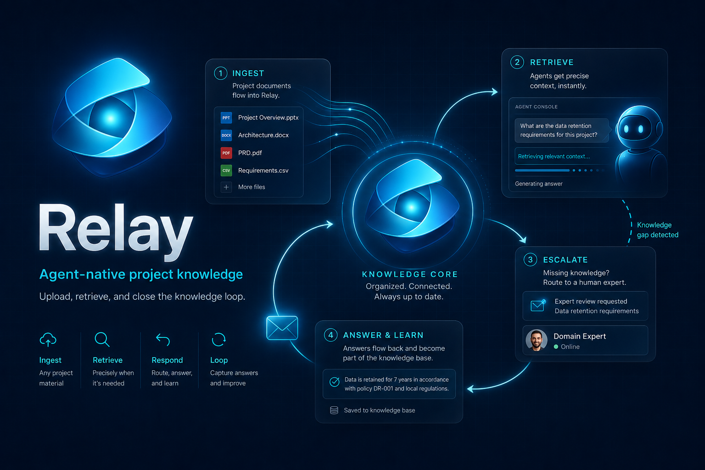
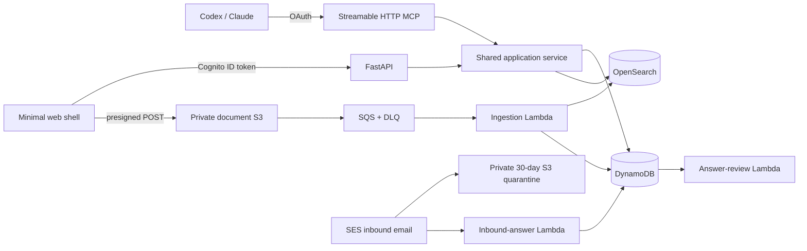

# Relay



Relay is an agent-native project knowledge system for Blend360. Codex, Claude,
or another authenticated MCP client is the primary application surface. The web
page is intentionally limited to connection help, login, plugin download, and
direct-to-S3 document upload.

The local source implements API/MCP contract `1.0.0`. It is not deployed by
normal development or test commands.

## Core behavior

- Cognito password authentication for verified `@blend360.com` employees.
  The hackathon deployment temporarily also permits any verified `@gmail.com`
  identity because Blend quarantines Cognito email; this is an explicitly
  flagged demo workaround, not the production authorization policy.
- Provider-neutral user profiles and a Cognito `admins` group.
- All verified employees can discover and read active projects and ask or
  answer questions.
- Authors, collaborators, and admins can edit project knowledge, upload,
  rename, answer, and manage collaborators.
- Only admins can archive or restore projects. There is no permanent project
  deletion.
- FastAPI and MCP call the same `KnowledgeApplication` service, so permissions
  and domain errors cannot drift between interfaces.
- All creation, upload, answer, invitation, and notification-producing
  operations require stable request IDs.
- The unauthenticated demo principal and token-based browser answer API have
  been removed.

## Architecture



The CDK stack provisions CloudFront, the private frontend bucket, Cognito,
API Gateway with a VPC Link, one ECS/Fargate API/MCP service, private S3
buckets, DynamoDB, OpenSearch Serverless, SQS queues and DLQs, ingestion,
identity, matching, notification, inbound-email, and review Lambdas, plus
optional Route 53 and SES domain resources.

## API and MCP v1

Every authenticated API operation has a same-named, typed MCP tool:

| Area | Operations |
| --- | --- |
| Account | `get_current_user`, `search_user_directory`, `list_my_notifications`, `mark_notification_read`, `list_my_collaboration_invitations`, `decide_collaboration_invitation` |
| Projects | `list_projects`, `get_project`, `create_project`, `rename_project`, `archive_project`, `restore_project` |
| Collaboration | `list_project_collaborators`, `invite_project_collaborator`, `remove_project_collaborator` |
| Retrieval | `search_all_projects`, `search_project_knowledge`, `list_project_documents`, `get_document`, `get_document_text`, `get_document_download_url` |
| Uploads | `prepare_document_upload` |
| Dossiers | `render_project_dossier` |
| Facts | `list_verified_facts`, `create_verified_fact` |
| Questions | `list_project_questions`, `list_my_assigned_questions`, `get_project_question`, `list_question_answers`, `create_project_question`, `submit_question_answer`, `review_question_answer`, `resend_question_email` |

The parity test treats only health, OAuth protocol routes, static configuration,
and inbound-email infrastructure as exemptions. Legacy MCP names are absent.

MCP results are bounded Pydantic models with stable IDs, status, permission
hints, warnings where relevant, and a next action. The server tells agents to
resolve real project IDs, treat search results as previews, open material
sources before citing them, and get explicit user confirmation before email,
collaborator, archive, rejection, or verified-fact actions.

The MCP URL after deployment is:

```text
https://<deployment-domain>/mcp/
```

Connecting it starts the OAuth browser flow. There is no no-auth mode in
contract v1.

## Uploads

`prepare_document_upload` is idempotent by project and `request_id`. It returns:

- a presigned S3 POST URL and required fields;
- the document ID and current ingestion status;
- expiry, supported extensions, and maximum size;
- whether the binary still needs uploading;
- an authenticated fallback page carrying project and request IDs.

Clients with a native local-file control upload directly to S3. Other clients
send the user to the fallback page. Binary data never crosses Fargate. After
upload, poll `get_document` until `READY` or `FAILED`.

Supported extensions are PDF, DOC, DOCX, PPTX, TXT, Markdown, CSV, and JSON.
The authenticated browser limit is 100 MiB per file; the model-level ceiling
matches it.

## Dossier rendering

The dossier skill researches a project, opens the material sources, and writes
the final cited Markdown locally. `render_project_dossier` then validates that
editorial contract and returns private, 15-minute download links for:

- an editable DOCX dossier;
- a polished PDF dossier.

The renderer makes no LLM calls and does not rewrite the agent's claims. It
stores the source Markdown and generated LaTeX beside the rendered files in
the private document bucket. A stable `request_id` makes retries idempotent;
reusing it with different Markdown is rejected.

The corresponding API operation is
`POST /api/projects/{project_id}/dossiers/render`. Any authenticated employee
who can read the active project can render a dossier. The rendered files are
not indexed as project evidence and are not sent outside Relay.

## Ingestion

PDF, DOC, DOCX, and PPTX are rendered as if printed. Deterministic extracted
text and the rendered PDF are both sent to `gpt-5.4-mini` at high image detail.
The model returns faithful, cleaned Markdown, recovers useful scanned or visual
information, and describes only informative tables, plots, diagrams,
architecture, process flows, and infographics—not logos, decoration, stock
imagery, footers, or page furniture.

Documents with more than three rendered pages are split before multimodal
processing. Pages are processed independently, indexed with locators, and
concatenated in order into one `document.md` that references the original.
There is no arbitrary token-based chunking. TXT, Markdown, CSV, and JSON use
deterministic parsing.

The original and enhanced Markdown are private S3 objects. OpenSearch contains
rebuildable BM25 text and `text-embedding-3-large` vectors.

## Questions and email answers

Questions may target an exact verified registered user. Agents resolve a named
answerer through `search_user_directory` and never infer an email address.
Project members and the requested person receive durable inbox notifications;
email is asynchronous and best effort.

Answers can contain text, up to ten same-project `READY` document IDs, or both.
Member/admin answers proceed to LLM sufficiency review. Other employee answers
wait for approval by a project member or admin; the first decision wins.

An assigned expert may also reply to the original email:

- the envelope recipient identifies the question;
- only the exact assigned sender is accepted;
- SES spam and virus verdicts are checked;
- explicit MIME attachments are parsed while inline logos are ignored;
- up to ten supported files and 25 MiB decoded total are accepted;
- attachment-only answers are valid;
- attachments enter a private 30-day quarantine using stable message/part
  hashes;
- member attachments are promoted immediately, while nonmember attachments
  wait for answer approval;
- promotion is a server-side S3 copy into the normal ingestion path.

The answer waits while promoted documents ingest. When all are `READY` or
`FAILED`, review receives the answer plus at most 200,000 characters of
supporting extracted text. Available evidence is used when some documents fail.
If neither usable text nor an extracted document remains, the expert is asked
for another response. Duplicate SES delivery, promotion, and approval are
idempotent.

Browser answer forms and `/api/public/question*` are gone. Old `#answer` links
show an informational notice directing the recipient to reply to the original
email or connect an agent.

## Collaboration discovery

Exact `@blend360.com` addresses extracted from source text or multimodal output
create collaborator access immediately, retain page/document evidence, and
notify the address. Unregistered email-keyed memberships bind when that address
later verifies.

Name-only contributor candidates retain evidence and are matched
conservatively against verified users by a dedicated Lambda. Only a unique
structured `MATCH` at or above `0.95` can create an invitation. Name
invitations remain disabled by default for shadow validation. Declines and
intentional collaborator removals create suppression records.

## Minimal website

The website has two deliberately narrow pages:

- `/` contains public branding, the MCP URL, connection instructions, plugin
  download, Cognito login, authenticated identity, and sign-out;
- `/upload.html` accepts the project and stable request ID from an agent- or
  email-generated URL, verifies that fixed project context after login, and
  provides direct-to-S3 file selection/drop, transfer progress, and
  current-session status polling.

The upload page has no project selector. A URL without valid project context
explains that the user must reopen the link supplied by their agent or email.

It intentionally has no project browser, creation form, search results,
document manager, downloads, questions, notifications, collaboration controls,
or answer submission.

## Agent plugin

`frontend/downloads/relay-bundle.zip` is a deterministic
Codex/Claude bundle at version `1.0.1`. It contains the authenticated remote MCP
configuration and two skills:

- `manage-project-knowledge`: safe project, collaborator, retrieval, upload,
  fact, inbox, and question workflows;
- `create-project-dossier`: evidence-first dossiers and participant sales
  briefs with inline citations, rendered to editable DOCX and polished PDF.

The MCP also exposes
`participant_sales_brief_generation(project_id, project_name,
additional_context?)`. It requires material claims and every metric to be cited
next to the claim, labels synthesis as **Inference**, and uses **Known gap**
instead of guessing.

Rebuild the archive and checksum locally:

```bash
uv run python scripts/build_plugin_bundle.py
```

## Local development

Requirements: Python 3.12 or 3.13, `uv`, Docker/Colima for image builds, Node
and the AWS CDK CLI for synthesis, and AWS credentials only for authenticated
CDK lookups or deployment.

```bash
uv sync --all-groups
uv run ruff check .
uv run pyright
uv run pytest -q
```

Validate both skills:

```bash
uv run --with pyyaml python \
  ~/.codex/skills/.system/skill-creator/scripts/quick_validate.py \
  plugins/relay/skills/manage-project-knowledge

uv run --with pyyaml python \
  ~/.codex/skills/.system/skill-creator/scripts/quick_validate.py \
  plugins/relay/skills/create-project-dossier
```

Synthesize without deploying:

```bash
uv run cdk synth
```

Deployment is a separate, explicit operation:

```bash
./scripts/deploy.sh
```

The script loads non-secret context from `.env`, deploys infrastructure,
outputs the frontend/API/MCP URLs, and finalizes CloudFront OAuth/CORS settings.
Set `PUBLIC_DOMAIN=essencesentry.shop` and `EMAIL_DOMAIN=essencesentry.shop` for
the hackathon domain. `MCP_AUTH_ENABLED` must remain `1`.
`DEMO_ALLOW_GMAIL_LOGINS=1` is a temporary hackathon-only workaround and must
be removed when Blend Microsoft SSO becomes the identity provider.

After a stack exists:

```bash
OPENAI_API_KEY='sk-...' ./scripts/configure_openai.sh
PASSWORD='...' uv run python scripts/create_user.py \
  agustin.sellanes@blend360.com --admin
```

The local bootstrap ingestion helper can create/reuse a project and upload
source files through the normal S3-triggered pipeline:

```bash
uv run python scripts/ingest_local_documents.py "PIH - Dataset" \
  --project-name "PIH Trial" \
  --uploaded-by agustin.sellanes@blend360.com \
  --count 20
```

Use `--dry-run` before a large bootstrap. Browser and MCP uploads should be used
for ordinary post-bootstrap documents.
