# Relay workflow documentation plan

## Purpose

This is the master runbook for documenting and demonstrating Relay. It defines
the story, workflow order, operator actions, expected results, and evidence to
capture. The individual user guides can be written from this runbook after the
live workflow has been rehearsed.

The demonstration should prove one idea:

> Relay lets a Blend360 employee manage project knowledge, retrieve grounded
> evidence, create cited artifacts, and close knowledge gaps without leaving
> their agent.

The website is intentionally small. It exists only to expose the MCP
connection, authenticate the user, and accept a file when an agent cannot
upload a local binary directly.

## Documentation set to produce

Create the final documentation in this order:

1. **Connect Relay to an agent**
   - Remote MCP connection for Codex, Claude, and compatible clients.
   - Dynamic workflow discovery through the MCP.
   - Optional skill ZIPs for portability or client compatibility.
   - Cognito sign-in and connection verification.
2. **Create and manage a project**
   - Create, inspect, rename, archive, and restore.
   - Explain roles and permission fields.
3. **Upload and process project documents**
   - Agent preparation.
   - Context-bound browser upload.
   - Ingestion status, original download, and Markdown download.
4. **Search and inspect project evidence**
   - Workspace discovery.
   - Project-scoped search.
   - Opening complete source text before citing it.
5. **Create a cited project dossier**
   - `get_project_dossier_template` workflow retrieval.
   - Evidence collection.
   - Inline citations, inference labels, and known gaps.
6. **Ask and answer a project question**
   - Knowledge-gap creation and confirmation.
   - Answer through the MCP.
   - Answer by replying in Outlook, with an optional attachment.
   - Completeness review, follow-up, resolution, and indexing.
7. **Work with notifications and collaboration**
   - Inbox notifications.
   - Manual invitations.
   - Exact-email collaborator discovery.
   - Name-only invitations when enabled.
8. **Understand authorization and administration**
   - Reader, author, collaborator, and administrator behavior.
   - Non-collaborator answer approval.
   - Archive and restore.
9. **Troubleshooting**
   - Authentication, upload, ingestion, search, email, and answer-review
     failures.

## Demonstration personas

### Core one-person demonstration

Use the same verified account in two roles:

- **Project owner:** `agustin.sellanes@blend360.com` in Codex.
- **Assigned expert:** the same address in Outlook.

This is a valid end-to-end test. The person changes surfaces and responsibilities
but not identity:

1. The owner asks a question through Codex.
2. Relay sends the question to the same verified mailbox.
3. The expert opens the message and replies from that exact mailbox.
4. Relay accepts the reply because its sender matches the assigned address.
5. Because the user is also the project author, the answer proceeds directly
   to completeness review.

This path can demonstrate email delivery, inbound reply processing,
attachments, follow-up questions, verified facts, and search indexing.

### Optional multi-user demonstration

A second registered and verified `@blend360.com` account is required to
demonstrate:

- manual invitation and acceptance;
- collaborator removal and suppression;
- a reader submitting an answer that requires member approval;
- invitation visibility in a different user's inbox;
- exact-email discovery granting access to someone other than the author.

Do not pretend that a one-user session proves these boundaries. If a second
identity is unavailable, document them with clearly labeled test evidence and
record a separate live demonstration later.

## Required environment and fixtures

### Surfaces

- Landing page: `https://essencesentry.shop/`
- MCP endpoint: `https://essencesentry.shop/mcp/`
- Codex desktop with the Relay MCP connected.
- Chrome with Outlook signed in to the assigned Blend360 mailbox.

### Test project

Use a dedicated project so the demonstration can be repeated without altering
real project knowledge:

```text
Relay Workflow Demo — YYYY-MM-DD
```

The agent should create stable request IDs for every write. Reuse the same ID
only when retrying the same intended operation.

### Test documents

Use the NCL project sequence in `data/Test Dataset` as the default evidence
fixture. Upload the decks in chronological order:

1. `25.7.14_NCL_Proposal_V1 - Copy.pptx`
2. `NCL-Steering-Committee (3) - Copy.pptx`
3. `NCL-Steering-Committee-122025 - Copy.pptx`
4. `2026.02.09 - SteeringCommittee - Copy.pptx`
5. `2026 - Pre-Post Architecture - Copy.pptx`

Together these decks show the project moving from proposal through delivery:
the initial R/Salesforce model estate, Snowflake ML and MLOps plan, model
inventory, feature store, migrations, monitoring, process improvements, and
pre/post architecture.

Do not upload the entire Test Dataset into this project. In particular:

- the two XLSX offering roadmaps are not project evidence and are not supported
  by the current ingestion contract;
- the offering DOCX files describe other propositions;
- the Marriott, Walmart, PM Copilot, Vialto, and hospitality decks are separate
  project or capability stories.

Keeping the NCL project coherent is part of the demonstration. Unrelated files
would weaken retrieval quality and make the known gap less credible.

Supported extensions are PDF, DOC, DOCX, PPTX, TXT, Markdown, CSV, and JSON.
The authenticated upload limit is 100 MiB per file. Email replies accept at
most 10 attachments and 25 MiB decoded in total.

### Deliberate NCL knowledge gap

The NCL steering material explicitly says that ownership is ambiguous for
three marketing models and recommends confirming the owner and SME for each
Tier 1 and Tier 2 model. The later NCL decks describe progress but do not name
those owners.

Use this exact gap:

> Which person owns each of the three NCL marketing models that the steering
> materials flag as having ambiguous ownership, and who is the accountable SME
> for each?

This is ideal for the workflow because:

- search should find the explicit statement of missing ownership;
- the agent should refuse to infer people from surrounding names;
- the dossier should report it as a known gap;
- the agent can ask an exact verified Blend360 address;
- an expert reply can close the gap and become searchable knowledge.

For a real project, the reply must contain the authentic ownership mapping. For
the isolated demo project, a clearly labeled synthetic mapping may be used so
no fictional owner is mistaken for production knowledge.

### Email readiness gate

Before recording the email workflow, verify all of the following:

- the SES sender domain is verified;
- inbound MX and the SES receipt rule are active;
- the AWS account can send to the chosen Blend360 recipient;
- the question reports `notification_status: SENT`;
- the outgoing message arrives in Outlook;
- Outlook sends replies from the exact assigned address rather than an alias.

If the SES account is still in sandbox mode, the recipient must be verified or
production sending must be enabled. A question can still be created when email
delivery fails, but that does not demonstrate the email workflow.

## Narrative order

```mermaid
flowchart LR
    A[Connect and sign in] --> B[Create a project]
    B --> C[Upload and ingest evidence]
    C --> D[Search and inspect sources]
    D --> E[Create a cited dossier]
    E --> F[Identify a knowledge gap]
    F --> G[Send a question]
    G --> H[Answer in Outlook or Codex]
    H --> I[Review and index the answer]
    I --> J[Find the new knowledge]
    J --> K[Show governance and cleanup]
```



The sequence matters. It first proves that Relay knows something, then proves
that it can recognize what it does not know, obtain the missing information,
and make that answer reusable.

## Step-by-step demonstration

## 1. Explain the intentionally small website

1. Open `https://essencesentry.shop/`.
2. Show the headline and the three Relay outcomes:
   - search trusted sources;
   - create cited briefs;
   - manage projects and knowledge gaps.
3. Point out that there is no project workspace on the site.
4. Show the “A small interface, on purpose” explanation.
5. Show the single copyable remote MCP URL.
6. Explain that Relay supplies its current project and dossier workflows
   dynamically after the agent connects.

Capture:

- the landing-page hero;
- the MCP connection card;
- the deliberate absence of a browser project workspace.

Expected result:

- the audience understands that the agent is the product surface;
- the website presents one unambiguous MCP connection path.

## 2. Connect Relay in Codex

1. Copy `https://essencesentry.shop/mcp/` from the landing page.
2. In Codex settings, choose the custom MCP connection option.
3. Name it `Relay`.
4. Select **Streamable HTTP**.
5. Paste the MCP URL.
6. Save and connect.
7. Confirm that substantial project work can call
   `get_project_knowledge_workflow` and dossier work can call
   `get_project_dossier_template` without a locally installed skill.
8. Treat `get_relay_skill_downloads` as an optional compatibility mechanism,
   not part of ordinary onboarding.

Record the exact Codex menu labels during rehearsal because desktop labels may
change between builds.

Capture:

- the connected custom MCP entry;
- one dynamic workflow response with its content hash;
- the connected status, without exposing tokens.

Expected result:

- Codex discovers the Relay MCP;
- the v1 tool surface is available;
- no legacy Relay tool names appear.

## 3. Complete OAuth sign-in

1. Trigger any Relay operation in Codex.
2. Allow Codex to open the browser authorization flow.
3. Sign in with the verified Blend360 email and password.
4. Complete the Cognito authorization.
5. Return to Codex.
6. Ask:

   > Use Relay to tell me which user is currently authenticated and whether I
   > am an administrator.

7. Verify that the agent calls `get_current_user`.

Capture:

- the Cognito sign-in page, without recording the password;
- the successful return to Codex;
- the bounded identity response.

Expected result:

- the email is normalized and ends in `@blend360.com`;
- the response includes administrator status;
- no bearer, ID, access, or refresh token is visible.

## 4. Create and inspect a project

1. Ask:

   > Create a project named “Relay Workflow Demo — YYYY-MM-DD” for this
   > end-to-end walkthrough.

2. Let the agent request confirmation only if its host policy requires it.
   Project creation itself does not send email.
3. Verify that `create_project` returns:
   - a stable project ID;
   - `my_role`;
   - `can_edit`;
   - `can_archive`;
   - a context-bound upload page URL;
   - a next action.
4. Ask the agent to list projects and locate the new project by name.
5. Rename it once to prove the ID remains stable:

   > Rename this project to “Relay Knowledge Workflow Demo — YYYY-MM-DD”.

6. Call `get_project` again and compare the ID.

Capture:

- the create result;
- the capability fields;
- the before-and-after project name with the unchanged ID.

Expected result:

- the creator becomes the project author;
- an administrator appears as `ADMIN`, while a non-admin creator appears as
  `AUTHOR`;
- the project is `ACTIVE` and editable.

## 5. Prepare and upload the evidence corpus

1. In Codex, ask:

   > Add the five NCL project decks from `data/Test Dataset` to this project in
   > chronological order and wait until all five are ready to search.

2. For each file, verify that the agent resolves the project ID and calls
   `prepare_document_upload` with:
   - filename;
   - content type;
   - exact byte size;
   - a stable request ID.
3. If Codex can send the file directly to the returned presigned S3 POST, use
   that native path.
4. Otherwise open the returned `fallback_url`.
5. If prompted, sign in on the upload page.
6. Show that the destination project is already fixed by the link and there is
   no project selector.
7. Drag the selected file onto the page or use the file picker.
8. Show transfer progress.
9. Repeat the prepared upload flow for all five NCL files. Each fallback URL
   remains bound to the same project but has its own stable upload request.
10. Keep the page open until it reports the current upload state.
11. Return to Codex.
12. Let the agent poll `get_document` until every document reaches `READY` or
    `FAILED`.
13. Ask the agent to list the project's documents.

Capture:

- the context-bound upload link;
- the project name and role on the upload page;
- the absence of a project selector;
- transfer progress;
- the final `READY` document record.

Expected result:

- binary data goes directly to S3 and never crosses the MCP/Fargate service;
- retrying the same preparation request does not create another document;
- the state progresses through ingestion and ends at `READY`.

## 6. Inspect the enhanced document

1. Ask:

   > Open the complete extracted text for “2026 - Pre-Post Architecture -
   > Copy.pptx”. Explain the model-lifecycle comparison and any other useful
   > visual information that was preserved.

2. Verify that the agent calls `get_document_text`, not only search.
3. Check that the Markdown:
   - is clean and ordered;
   - includes meaningful information from the table, chart, diagram, process,
     or architecture;
   - does not narrate logos, banners, stock imagery, footers, or decorative
     page furniture.
4. Ask for the Markdown download URL.
5. Optionally ask for the original download URL and show that both are
   time-limited.

Capture:

- a source-text response with page or slide locators;
- one useful visual description;
- the original/Markdown download choices without exposing the signed URL in
  published documentation.

Expected result:

- the enhanced Markdown is available as one logical document;
- rendered documents preserve page order;
- meaningful visuals supplement missing or weak extracted text.

## 7. Search and answer from grounded evidence

1. Ask a broad discovery question:

   > Which project contains evidence about modernizing NCL's machine-learning
   > lifecycle in Snowflake?

2. Verify that the agent uses `search_all_projects`.
3. Ask a project-specific question the NCL sources can answer:

   > In the NCL demo project, how did model development, feature engineering,
   > deployment, inference, and monitoring change? Cite each claim to the
   > relevant slide.

4. Verify that the agent:
   - uses one or more focused `search_project_knowledge` calls;
   - treats hits as previews;
   - opens the material document with `get_document_text`;
   - cites the document name and page, slide, or locator.
5. Ask:

   > Who owns the three NCL marketing models whose ownership was still
   > ambiguous, and who is the accountable SME for each?

6. Confirm that the agent finds the ambiguity in the steering materials but
   states that the names are missing instead of guessing.

Capture:

- a workspace search result;
- a grounded answer with an inline locator;
- an explicit knowledge gap.

Expected result:

- retrieval scores are not presented as proof;
- every material claim is backed by opened source text;
- unsupported information is not invented.

## 8. Generate a cited dossier

1. Start with a natural prompt:

   > Create an executive dossier for the NCL machine-learning modernization
   > project.

2. Verify that the agent calls `get_project_dossier_template` before research.
3. Observe the agent:
   - resolve the exact project;
   - start with several focused `search_all_projects` calls;
   - use project or document inventory only if focused search is insufficient;
   - open every material source;
   - draft the final Markdown only after evidence collection;
   - call `render_project_dossier` with the complete Markdown and a stable
     request ID.
4. Review the finished Markdown.
5. Confirm:
   - material facts have adjacent citations;
   - every metric has a direct citation;
   - synthesis is labeled **Inference**;
   - missing evidence is labeled **Known gap**;
   - only opened and cited documents appear in **Sources Used**;
   - decorative imagery is omitted.
6. Open both returned links and inspect the editable DOCX and polished PDF.

Capture:

- the dynamic dossier workflow response;
- a concise excerpt of the finished brief;
- one metric citation, one inference label, and one known gap when available.
- the returned DOCX and PDF links;
- representative pages from both rendered files.

Expected result:

- the result is a business-facing brief, not retrieval narration;
- the agent follows the dynamically returned editorial contract in addition to
  MCP tool schemas;
- retrying with the same request ID refreshes the links without creating a
  second dossier render.

## 9. Create a question for the assigned expert

1. Return to the unsupported NCL ownership question identified earlier.
2. Ask:

   > Ask `agustin.sellanes@blend360.com` who owns each of the three NCL
   > marketing models flagged with ambiguous ownership and who the accountable
   > SME is for each.

3. Verify that the agent describes the email-producing action and asks for
   explicit confirmation.
4. Confirm the exact project, question, and recipient.
5. Let the agent call `create_project_question`.
6. Inspect the returned:
   - question ID;
   - assigned address;
   - priority;
   - question status;
   - email notification status;
   - next action.
7. Ask the agent to list assigned questions and confirm that the new question
   appears.

Capture:

- the agent's confirmation request;
- the user's confirmation;
- the created question with `OPEN` status;
- `notification_status: SENT`, or a clearly documented delivery failure.

Expected result:

- the address is exact and is never inferred from a person's name;
- retrying with the same request ID does not send another initial email;
- the question is durable even if email delivery fails.

## 10. Receive and answer the question in Outlook

1. Switch to Outlook in Chrome.
2. Find the message with a subject beginning:

   ```text
   [Blend360] Your expertise is needed
   ```

3. Show:
   - project name;
   - priority;
   - question;
   - optional agent context;
   - the two response paths: reply by email or connect an agent.
4. Click **Reply**. Do not start a new message.
5. Verify the From address exactly matches the assigned expert address.
6. Write a concrete answer that directly addresses the question.

   For a real workflow, provide the authentic names and roles. For an isolated
   rehearsal, use an unmistakably synthetic answer such as:

   ```text
   DEMO-ONLY RESPONSE — this is synthetic ownership data for the Relay
   Workflow Demo project.

   - Einstein Contact Models (RSSC and OCI): Avery Example is the demo owner;
     Morgan Example is the accountable demo SME.
   - Email and Direct Mail Frequency Models: Jordan Example is the demo owner;
     Casey Example is the accountable demo SME.
   - Next Best Destination Model: Taylor Example is the demo owner; Riley
     Example is the accountable demo SME.

   Do not reuse this mapping outside the demo project.
   ```

7. For the simplest missing-information demonstration, leave the reply without
   an attachment.
8. In a second rehearsal, optionally attach a small supported document
   containing the same authentic or demo-only mapping to demonstrate
   attachment quarantine, promotion, ingestion, and review.
9. Send the reply.
10. Return to Codex.
11. Ask:

    > Inspect the latest answers and review status for the question we just
    > sent.

12. If an attachment was used, observe the answer move through document
    processing before completeness review.
13. Poll until the answer becomes:
    - `ACCEPTED`; or
    - `NEEDS_MORE_INFO`.

Capture:

- the received question email;
- the reply composition with the correct sender;
- the attachment, without exposing sensitive content;
- the answer's state transition in Codex.

Expected result:

- only a reply from the exact assigned sender is accepted;
- inline logos and signature images are ignored;
- a project-member answer skips human approval;
- a supported attachment is quarantined, promoted, ingested, and included in
  review;
- duplicate email delivery is idempotent.

## 11. Complete an LLM follow-up when necessary

If the answer is `NEEDS_MORE_INFO`:

1. Wait for the follow-up email.
2. Open it in Outlook.
3. Show the missing details and review rationale.
4. Reply with only the missing information. Do not repeat the earlier answer.
5. Return to Codex and inspect the question again.
6. Verify that Relay reviews the cumulative answer history.
7. Continue until the answer is accepted or a real information gap remains.

Capture:

- the focused follow-up request;
- the second reply;
- the final accepted state.

Expected result:

- follow-up answers accumulate instead of replacing earlier information;
- Relay does not require the expert to restate a complete answer.

## 12. Show that the accepted answer became knowledge

After acceptance:

1. Ask the agent to get the question and list its answers.
2. Verify:
   - question status is `RESOLVED`;
   - answer status is `ACCEPTED`;
   - the answer references a generated document.
3. Ask the agent to list verified facts for the project.
4. Find the fact created from the reviewed expert answer.
5. Search the project using wording different from the original question.
6. Open the generated `EXPERT_QA` document supporting the result.
7. Cite it in the response.

Capture:

- resolved question;
- accepted answer;
- generated knowledge document;
- verified fact and provenance;
- a new search result grounded in the expert answer.

Expected result:

- sufficient expert knowledge is normalized, indexed, and reusable;
- the verified fact records the assigned expert and server-side review as
  provenance.

## 13. Demonstrate the MCP answer path

Use a second question to avoid mixing the two answer paths:

1. Create and assign another question after explicit confirmation.
2. In Codex, ask:

   > List my assigned questions and open the newest one.

3. Verify `list_my_assigned_questions`, `get_project_question`, and
   `list_question_answers` are used.
4. Submit an answer through the agent.
5. Optionally reference up to 10 same-project documents that are already
   `READY`.
6. Reuse the same request ID if the call must be retried.
7. Poll until review finishes.

Expected result:

- an answer may contain text, supporting documents, or both;
- a project member's answer proceeds directly to completeness review;
- the email and MCP paths converge on the same review and indexing workflow.

## 14. Show notifications

1. Ask:

   > Show my unread Relay notifications.

2. Inspect question, answer, collaboration, or attachment notifications.
3. Choose one notification whose work has been completed.
4. Ask the agent to mark it read.
5. List unread notifications again.

Expected result:

- notifications are durable and user-specific;
- email is a secondary delivery channel rather than the only record.

## 15. Demonstrate collaboration with a second account

Run this section only when a second registered user exists.

### Manual invitation

1. As the project author, list current collaborators.
2. Ask the agent to invite the second exact Blend360 address.
3. Verify that the agent asks for explicit confirmation because this changes
   access and sends email.
4. Confirm and create the invitation.
5. Sign into Relay as the invited user.
6. List collaboration invitations.
7. Accept the invitation.
8. Get the project and verify `COLLABORATOR` plus edit access.

### Non-collaborator answer review

1. Use a verified employee who is not a project member.
2. Submit an answer to an active project question.
3. Verify that the answer becomes `PENDING_HUMAN`.
4. Return to the project author.
5. List the answers.
6. Approve the answer, or explicitly confirm before rejecting it.
7. Verify that only the first review decision wins.
8. If approved, observe the normal completeness-review path.

### Exact-email discovery

1. Upload a document that explicitly contains the second user's full
   `@blend360.com` email and evidence of project contribution.
2. Wait for ingestion.
3. List collaborators.
4. Verify the membership source is `DOCUMENT_EXACT_EMAIL`.
5. Confirm that the user received a notification.

Do not construct an email from a contributor name. Name-only discovery should
be demonstrated only after invitations are enabled and conservative matching
has been validated.

## 16. Demonstrate administration and clean up

Run archive/restore only against the dedicated demo project.

1. Ask to archive the project.
2. Verify that the agent asks for explicit confirmation and states the exact
   project.
3. Confirm the archive.
4. Show that a normal employee can no longer discover the archived project.
5. As an administrator, list projects with archived projects included.
6. Restore the project.
7. Verify its documents and ID remain unchanged.
8. Decide whether to leave the demo project active for later documentation or
   archive it as cleanup.

Expected result:

- only administrators can archive or restore;
- there is no permanent project deletion;
- archive preserves the project's knowledge and identity.

## Evidence capture checklist

Capture these items while rehearsing:

- [ ] Landing page and MCP connection explanation.
- [ ] MCP configuration and dynamic workflow retrieval.
- [ ] OAuth sign-in and connected Codex state.
- [ ] `get_current_user` result.
- [ ] Project creation and permission fields.
- [ ] Context-bound upload page without a selector.
- [ ] Upload progress and final `READY` state.
- [ ] Enhanced Markdown with one informative visual.
- [ ] Workspace search and project-scoped search.
- [ ] Source opened before a cited answer.
- [ ] Dossier excerpt with inline citations.
- [ ] Confirmation before a question email.
- [ ] Question email in Outlook.
- [ ] Outlook reply and optional attachment.
- [ ] Answer state transition.
- [ ] Follow-up email when applicable.
- [ ] Resolved question, generated document, and verified fact.
- [ ] Search result using the new expert knowledge.
- [ ] Notification read flow.
- [ ] Optional invitation and non-collaborator review.
- [ ] Optional archive and restore.

Never capture:

- passwords;
- Cognito authorization codes;
- bearer, ID, access, or refresh tokens;
- presigned S3 URLs or fields;
- private source content that is not approved for documentation;
- AWS credentials or secret values.

## Success criteria

The core workflow is ready to document when one uninterrupted rehearsal proves:

1. Codex connects to Relay and authenticates the correct user.
2. The user creates a project and receives author/admin capabilities.
3. A local file reaches S3 through the direct upload workflow.
4. Ingestion produces searchable enhanced Markdown.
5. The agent answers from opened evidence with citations.
6. The dossier skill produces a grounded brief with citations and honest gaps.
7. A confirmed question reaches the assigned Outlook mailbox.
8. A reply from that exact mailbox is accepted.
9. Any attachment finishes ingestion before completeness review.
10. The accepted answer resolves the question and creates searchable knowledge.

## Rehearsal notes and troubleshooting

### OAuth does not return to Codex

- Restart the connection from Codex instead of reusing an old authorization
  tab.
- Confirm the MCP URL ends in `/mcp/`.
- Confirm the login account is a verified `@blend360.com` identity.

### Upload page has no project context

- Reopen the exact fallback URL returned by `prepare_document_upload`.
- Do not navigate directly to `/upload.html`.
- Do not add a project selector; missing context is an intentional safety
  failure.

### Document remains non-terminal

- Use `get_document` to inspect status and failure detail.
- Keep polling until `READY` or `FAILED`; complex rendered documents may take
  several minutes.
- If it fails, preserve the document ID and error for the troubleshooting
  guide.

### Search returns a preview but the answer is weak

- Run several focused queries.
- Open the strongest material documents with `get_document_text`.
- Do not cite only the search preview.

### Question exists but no email arrives

- Inspect `notification_status` and its failure detail.
- Verify SES sending access and recipient eligibility.
- Check Outlook junk/quarantine.
- Use `resend_question_email` only after explicit confirmation and with a new
  request ID for the deliberate resend.

### Outlook reply is ignored

- Confirm it was a reply to the original message.
- Confirm the sender exactly matches `assigned_expert_email`.
- Confirm the original reply address was preserved.
- Confirm spam and virus verdicts passed.

### Answer needs more information

- Treat this as a valid workflow, not a failure.
- Show the focused follow-up.
- Reply with only the missing detail.
- Verify that cumulative history is used in the next review.

## Follow-up work

After the first live rehearsal:

1. Replace any Codex UI wording in this plan with the labels observed in the
   installed desktop version.
2. Record actual timing ranges for OAuth, upload, ingestion, email delivery,
   and answer review.
3. Add sanitized screenshots to the individual workflow guides.
4. Split this master runbook into the nine documents listed at the beginning.
5. Add a short quick-start that links to the detailed guides.
